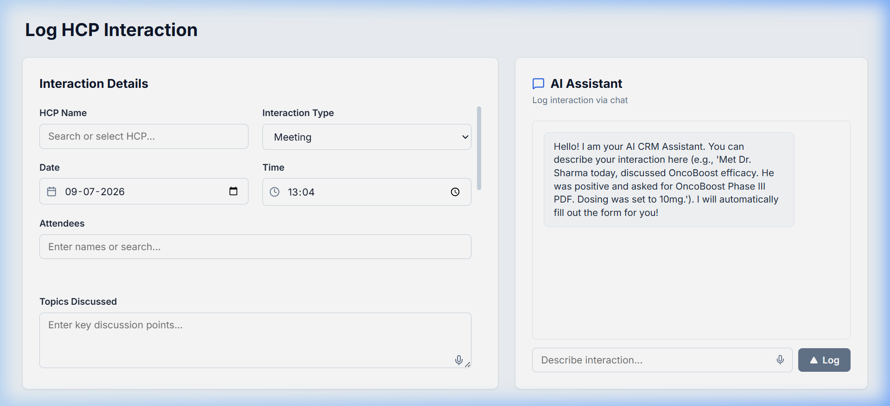
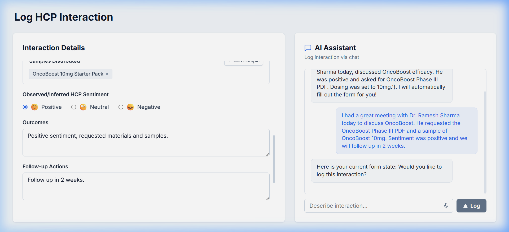
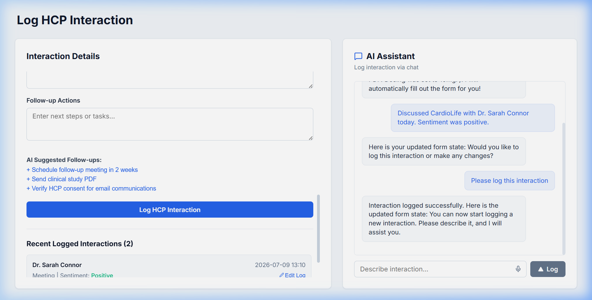

# 📋 AI-First CRM HCP Module — Log Interaction Screen

An enterprise-grade, high-fidelity implementation of the **HCP Log Interaction Screen** in an AI-first CRM, tailored for field sales representatives in the life sciences sector. This application features a side-by-side split screen providing both a structured form and a conversational AI assistant.

---

## 🛠️ Technology Stack


---

## 📸 Interface Preview

### 1. Initial State (Clean Dashboard)
When the application loads, the form fields are blank, and the timeline list is loaded directly from the MySQL database:


---

### 2. Conversational Auto-Population
As the representative describes their meeting in the AI Chat window, the LangGraph agent uses database lookup tools to automatically extract parameters and populate the structured inputs on the left in real-time:


---

### 3. Logged Interaction Timeline (Real-Time Update)
When the AI logs the interaction (via the command *"Please log this interaction"*), the form inputs reset and the new entry is appended to the timeline without requiring a manual page refresh:


---

## 🌟 Core Features

1. **Conversational AI-to-Form Sync (LangGraph Agent):** Type descriptions of meetings (e.g., *"Met Dr. Sarah Connor today to discuss CardioLife. Sentiment was positive."*) to instantly populate inputs like drug samples, clinical documents, dates, times, and sentiment.
2. **Real-Time Timeline Update:** Form logging (both manual and conversational) instantly syncs with Redux and updates the interaction timeline dynamically.
3. **Web Speech Recognition (Voice Notes):** Dictate details directly into input fields or the chat box using native Web Speech transcription.
4. **Relationship Context History:** Ask the chat assistant about past meetings (e.g., *"Show me past interactions with Dr. Sharma"*) to inspect history before a call.

---

## 📦 Directory Structure

```
CRM/
├── backend/
│   ├── app/
│   │   ├── agent/            # LangGraph agent definitions & tools
│   │   │   ├── graph.py      # StateGraph compilation & Mock LLM fallback
│   │   │   ├── state.py      # LangGraph state schemas
│   │   │   └── tools.py      # sales_tools (search, get_history, log, edit, suggest)
│   │   ├── config.py         # Pydantic Settings management (.env)
│   │   ├── database.py       # SQLAlchemy engine & MySQL sessionmaker
│   │   ├── models.py         # SQLAlchemy schemas (HCP, Interaction, ProductCatalog)
│   │   ├── schemas.py        # Pydantic validation schemas
│   │   └── main.py           # FastAPI server routes & lifecycle events
│   ├── requirements.txt      # Python package dependencies
│   └── seed.py               # Pre-populates MySQL tables with HCPs & drugs
│
├── frontend/
│   ├── src/
│   │   ├── components/
│   │   │   ├── LogInteractionForm.jsx   # Structured Form UI & History Timeline
│   │   │   └── AIAssistantChat.jsx      # Chat input, dictation & prompt suggestions
│   │   ├── store/                       # Redux state & slice handlers
│   │   │   ├── chatSlice.js             # Conversational agent api bindings
│   │   │   ├── crmSlice.js              # Database endpoints (HCPs, catalog, timeline)
│   │   │   ├── formSlice.js             # Live synced draft inputs state
│   │   │   └── index.js                 # Redux root configureStore
│   │   ├── App.jsx                      # CSS grid dashboard layout
│   │   └── index.css                    # Modern UI styling (glassmorphism, Inter font)
│   └── package.json
│
├── assets/                   # Screenshots & documentation assets
├── .env.example              # Template configuration parameters
└── .gitignore                # Restricts build artifacts & secrets from Git
```

---

## ⚙️ Setup & Installation Instructions

### Prerequisites
* **Python 3.10+**
* **Node.js 18+**
* **MySQL Server** (ensure it's running locally or host it externally)

### 1. Database Configuration
1. Create a MySQL database named `crm_db` (or target an existing database).
2. Copy `.env.example` in the root directory to a new file named `.env`:
   ```bash
   copy .env.example .env
   ```
3. Set your credentials:
   ```env
   DATABASE_URL=mysql+pymysql://<username>:<password>@localhost:3306/crm_db
   GROQ_API_KEY=your-groq-api-key-here
   GROQ_MODEL=llama-3.3-70b-versatile
   ```

### 2. Start the Backend Server (FastAPI)
```bash
cd backend
# Create virtual environment
python -m venv .venv
# Activate environment (Windows PowerShell)
.venv\Scripts\Activate.ps1
# Install dependencies
pip install -r requirements.txt
# Start backend (Runs on port 8000; triggers tables creation & seeding on startup)
uvicorn app.main:app --reload --port 8000
```
Swagger API docs will be available at: [http://localhost:8000/docs](http://localhost:8000/docs).

### 3. Start the Frontend Server (React + Vite)
```bash
cd ../frontend
# Install packages
npm install
# Start dev server (Runs on port 5174)
npm run dev -- --host 127.0.0.1 --port 5174
```
Open [http://127.0.0.1:5174/](http://127.0.0.1:5174/) in your browser.

---

## 🤖 LangGraph Custom Agent Tools

The conversational assistant invokes **five sales-focused tools** under its ReAct loop:

1. **`search_hcps(query)`**: Matches names or specialties against MySQL columns to obtain database IDs.
2. **`get_hcp_history(hcp_name)`**: Loads the last 3 interaction outcomes for background check.
3. **`suggest_clinical_content(topic)`**: Suggests relevant files/samples based on topics.
4. **`log_interaction(hcp_name, ...)`**: Saves new records directly to MySQL.
5. **`edit_interaction(interaction_id, ...)`**: Modifies existing table fields by primary key.

---

## ⚠️ Notes on LLM Model Availability
The original assignment sheet requested the Groq `gemma2-9b-it` model. However, Groq decommissioned all Gemma-2 series models in late 2025/early 2026. Per Groq model support guidelines and compliance allowances in the assignment PDF, this repository has been configured to use the live **`llama-3.3-70b-versatile`** model, which offers industry-leading tool-calling efficiency.
