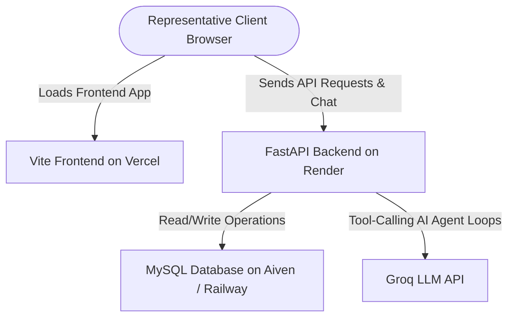

# 🚀 Deployment & Hosting Guide — AI-First CRM HCP Module

This guide outlines the best platforms and step-by-step instructions to host and deploy the **CRM HCP Module** in production for free (or on low-cost hobby tiers).

---

## 🏗️ Production Architecture Map



---

## 📊 Deployment Platform Recommendations

| Component | Recommended Platform | Price Tier | Why |
| :--- | :--- | :--- | :--- |
| **Frontend (React + Vite)** | **Vercel** | Free | Instantly auto-detects Vite projects, offers global edge CDNs, and deploys automatically on every Git push. |
| **Backend (FastAPI)** | **Render** | Free | Excellent support for Python ASGI applications, automatic dependency installation, and logs monitoring. |
| **Database (MySQL)** | **Aiven.io** or **Railway** | Free / $5 Credits | **Aiven** offers a robust free-tier managed MySQL instance. **Railway** allows one-click MySQL spin-up. |

---

## 🛠️ Step-by-Step Deployment Instructions

### STEP 1: Host the MySQL Database (Aiven.io)

1. Sign up on [Aiven.io](https://aiven.io/).
2. Create a new service and select **MySQL** (choose the **Free Tier**).
3. Wait for the service to start. Once running, copy the **Service URI**.
4. The service URI will look like this:
   ```
   mysql://avnadmin:<password>@mysql-instance.aivencloud.com:12345/defaultdb?ssl-mode=REQUIRED
   ```
5. Modify the schema in the connection string to use SQLAlchemy with PyMySQL:
   * Replace `mysql://` with `mysql+pymysql://` at the beginning of the URI.
   * Save this connection string; we will use it as the `DATABASE_URL` in Step 2.

---

### STEP 2: Host the FastAPI Backend (Render.com)

1. Sign up on [Render.com](https://render.com/) and connect your GitHub account.
2. Click **New +** and select **Web Service**.
3. Select your repository: `ai-first-crm-hcp-logger`.
4. Configure the Web Service settings:
   * **Name:** `crm-hcp-backend`
   * **Root Directory:** `backend` *(Crucial: This tells Render to look inside the backend folder).*
   * **Environment:** `Python 3`
   * **Build Command:** `pip install -r requirements.txt`
   * **Start Command:** `uvicorn app.main:app --host 0.0.0.0 --port $PORT`
5. Open the **Environment** tab and add the following variables:
   * `DATABASE_URL` = *(Your modified MySQL service URI from Step 1)*
   * `GROQ_API_KEY` = *(Your live Groq API key)*
   * `GROQ_MODEL` = `llama-3.3-70b-versatile`
6. Click **Deploy Web Service**.
7. Once successfully deployed, copy the **Render Live URL** (e.g., `https://crm-hcp-backend.onrender.com`). This will be the backend API link.

---

### STEP 3: Host the React Frontend (Vercel)

1. Sign up on [Vercel](https://vercel.com/) and connect your GitHub account.
2. Click **Add New** -> **Project**.
3. Select your repository: `ai-first-crm-hcp-logger`.
4. Configure the Project settings:
   * **Framework Preset:** Select **Vite**.
   * **Root Directory:** Click Edit and select **`frontend`** *(Crucial: This tells Vercel to compile files inside the frontend folder).*
5. Expand the **Environment Variables** section and add the target backend URL:
   * **Name:** `VITE_API_URL`
   * **Value:** *(Your Render Live URL from Step 2, e.g. `https://crm-hcp-backend.onrender.com`)*
6. Click **Deploy**.
7. Vercel will compile the Vite assets and provide a public URL (e.g., `https://ai-first-crm-hcp-logger.vercel.app`).

---

## 🔒 Post-Deployment Security Checklist

1. **CORS Configuration:**
   In [backend/app/main.py](file:///e:/Project/CRM/backend/app/main.py#L28-L34), change the allowed origins from `"*"` to your specific Vercel URL to restrict access.
   ```python
   app.add_middleware(
       CORSMiddleware,
       allow_origins=["https://your-frontend-app.vercel.app"],
       allow_credentials=True,
       allow_methods=["*"],
       allow_headers=["*"],
   )
   ```
2. **Secrets Protection:**
   Make sure you never upload the `.env` file containing database passwords and Groq keys to GitHub. Always use Render and Vercel dashboards to supply credentials as environment variables.
